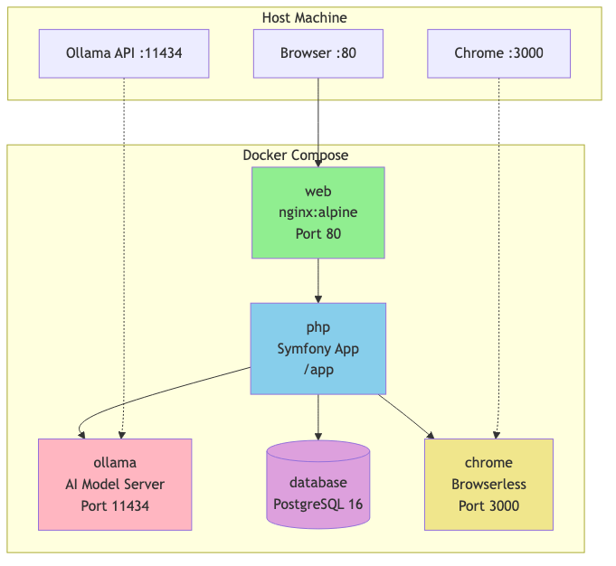
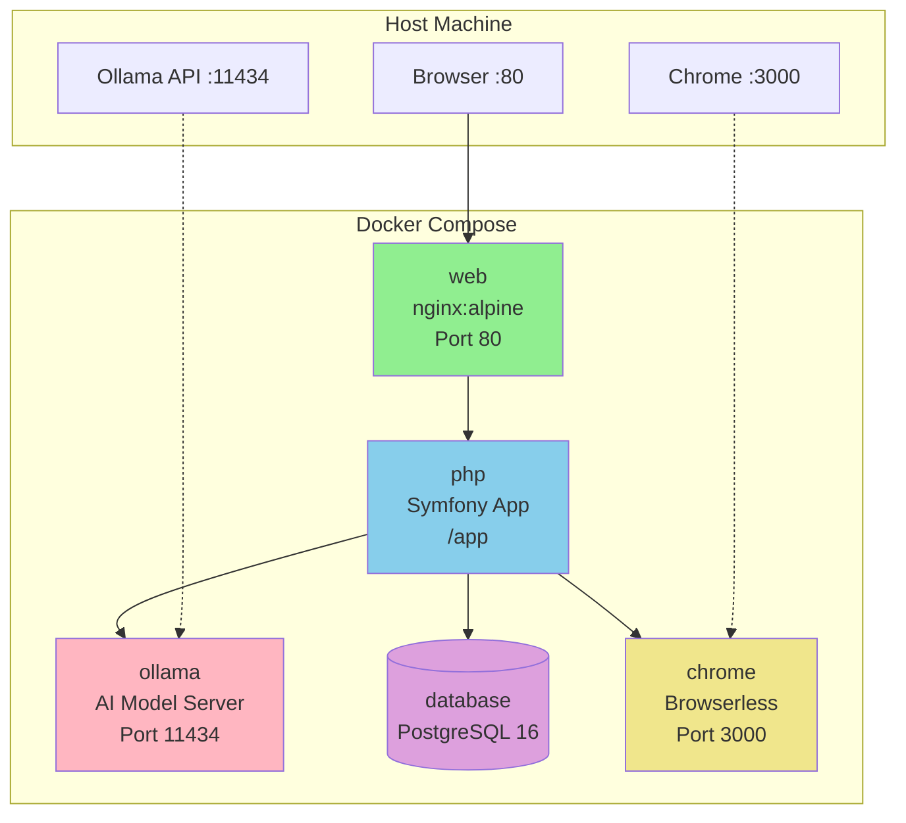
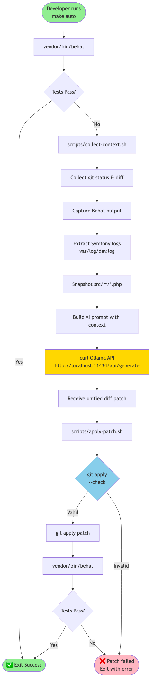
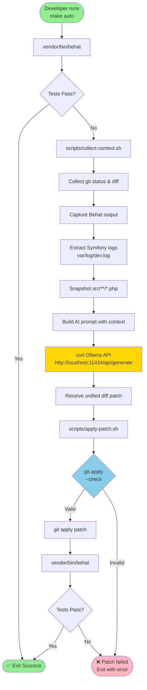
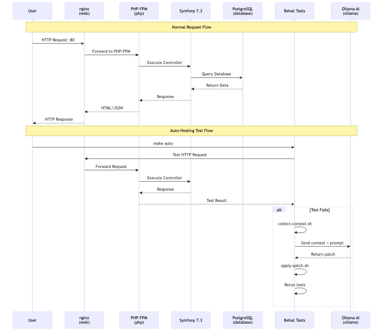
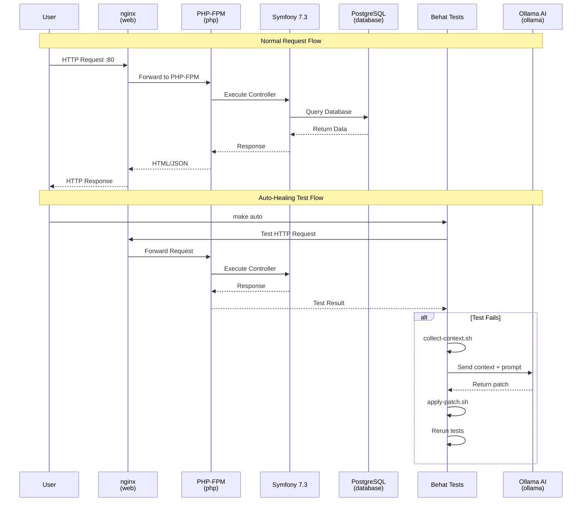

# CLAUDE.md

This file provides guidance to Claude Code (claude.ai/code) when working with code in this repository.

## Project Overview

Auto-BDD is a **self-healing BDD testing framework** for Symfony applications. It uses AI (via Ollama) to automatically fix failing Behat tests by analyzing errors, generating patches, and applying them to the codebase. The system runs in an automated loop: run tests → collect context on failures → query AI for fixes → apply patches → re-run tests.

**Technology Stack:**
- Symfony 7.3 (PHP 8.2+)
- Behat 3.25 with Mink extension for BDD testing
- Ollama (local AI model) for code generation
- Docker (nginx, php, postgres, ollama, chrome/browserless)

## Development Commands

### Initial Setup
```bash
docker compose up -d --build    # Start all services
make init                       # Install dependencies and initialize Behat
make ai-model                   # Download Ollama model (qwen2.5-coder)
```

### Running Tests
```bash
make test                       # Run Behat tests manually
make auto                       # Run auto-healing loop (test → AI fix → retest)
```

### Direct Commands
```bash
# Inside PHP container
docker compose exec php bash -lc "vendor/bin/behat"              # Run Behat
docker compose exec php bash -lc "php bin/console about"         # Check Symfony
docker compose exec php bash -lc "composer install"              # Install deps

# Change AI model (edit scripts/auto-bdd.sh)
# Default model: qwen2.5-coder
# Alternatives: llama3.1, codellama, etc.
```

## Architecture Diagrams

### Docker Stack





### Auto-Healing Workflow





### Request Flow





### Auto-Healing BDD Loop (`scripts/auto-bdd.sh`)

The core workflow:

1. **Run Behat tests** (`vendor/bin/behat`)
2. **If tests pass**: Exit successfully
3. **If tests fail**:
   - Collect context via `scripts/collect-context.sh`:
     - Git status and diff
     - Behat output
     - Symfony logs (var/log/dev.log)
     - Source code snapshots (src/**/*.php)
   - Send context to Ollama with prompt requesting a unified diff patch
   - Apply patch via `scripts/apply-patch.sh` (validates with `git apply --check` first)
   - Re-run Behat tests

### Key Components

**`scripts/collect-context.sh`**: Gathers diagnostic information for AI analysis
- Git state (status, diff)
- Behat test output
- Symfony logs (last 200 lines)
- PHP source code (first 200 lines of each file in src/)

**`scripts/apply-patch.sh`**: Safely applies AI-generated patches
- Validates patch with `git apply --check` before applying
- Only accepts patches that modify `src/` and `features/` directories

**`tests/Behat/FeatureContext.php`**: Custom Behat context
- Extends RawMinkContext for web testing
- Uses PHP 8 attributes for step definitions (#[Then], #[When])
- Integrates with Symfony via FriendsOfBehat extensions

**`behat.yml`**: Behat configuration
- Base URL: `http://web:80` (nginx service in Docker)
- Uses Symfony session for testing (no JavaScript execution)
- Test environment with debug enabled

### Docker Services

- **web**: Nginx (port 80) - serves Symfony app
- **php**: PHP-FPM with Symfony app (working dir: /app)
- **ollama**: AI model server (port 11434)
- **database**: PostgreSQL 16
- **chrome**: Browserless Chrome for headless testing (port 3000)

## Important Patterns

### AI Prompt Engineering

The AI is instructed to:
- Generate **only** unified diff patches (ready for `git apply -p0`)
- Fix failing tests without breaking existing functionality
- Modify only files under `src/` (and optionally features/)
- Produce no commentary outside the diff

### Safety Mechanisms

1. **Patch validation**: All patches must pass `git apply --check` before application
2. **Scope restriction**: Only patches affecting `src/` and `features/` are applied
3. **Incremental testing**: Tests re-run after each patch application

### Behat Testing

- **Session**: Uses Symfony session (BrowserKit) for faster testing without real browser
- **Extensions**: FriendsOfBehat for Symfony integration
- **Context**: Custom FeatureContext extends RawMinkContext, uses PHP attributes

## Workflow

**Typical development cycle:**
1. Write/edit BDD scenarios in `features/*.feature`
2. Run `make auto` to trigger the auto-healing loop
3. The system will:
   - Run tests
   - Identify failures
   - Generate fixes via AI
   - Apply patches
   - Verify fixes
4. Review AI-generated changes in git diff

**Manual intervention:** If the auto-loop fails or produces incorrect fixes, manually edit code and re-run `make test`.

## Configuration Files

- **composer.json**: Symfony 7.3 dependencies, Behat/Mink for testing
- **docker-compose.yaml**: Multi-service setup (web, php, ollama, database, chrome)
- **behat.yml**: Behat suite configuration with Mink extension
- **Makefile**: Command shortcuts for development tasks
- **scripts/auto-bdd.sh**: Main auto-healing orchestration script
